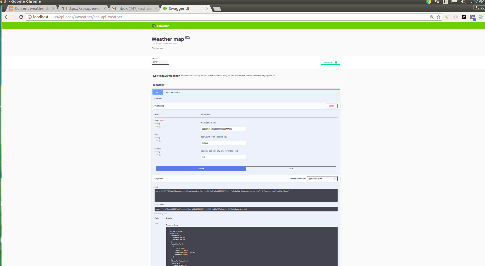

# A Basic Weather forecast app(beta)

# Dependecies

1. node and npm 
2. mongodb

## How to run

1. Clone this repo 
   `$ git clone https://github.com/ashwinitodkar/weather-map.git`
2. `$ cd ./weather-map`
3. `$ npm install`
4. start api server `$ node app.js`


## API Look

1. Desktop View



# API Documentation

1. Get today's weather if today is prime number
```
Url: http://localhost:8088/api/weather?key={apiKey}
Method: GET
Response:
{
  "prime": true,
  "data": {
    "coord": {
      "lon": 73.85,
      "lat": 18.52
    },
    "weather": [
      {
        "id": 800,
        "main": "Clear",
        "description": "clear sky",
        "icon": "01n"
      }
    ],
    "base": "stations",
    "main": {
      "temp": 290.534,
      "pressure": 954.22,
      "humidity": 90,
      "temp_min": 290.534,
      "temp_max": 290.534,
      "sea_level": 1029.62,
      "grnd_level": 954.22
    },
    "wind": {
      "speed": 2.23,
      "deg": 107.011
    },
    "clouds": {
      "all": 0
    },
    "dt": 1549909087,
    "sys": {
      "message": 0.0054,
      "country": "IN",
      "sunrise": 1549848855,
      "sunset": 1549890218
    },
    "id": 1259229,
    "name": "Pune",
    "cod": 200
  }
}
```

2. Curl

```
curl -X GET "http://localhost:8088/api/weather?key={apiKey}" -H "accept: application/json"

Response:

{
  "prime": true,
  "data": {
    "coord": {
      "lon": 73.85,
      "lat": 18.52
    },
    "weather": [
      {
        "id": 800,
        "main": "Clear",
        "description": "clear sky",
        "icon": "01n"
      }
    ],
    "base": "stations",
    "main": {
      "temp": 290.534,
      "pressure": 954.22,
      "humidity": 90,
      "temp_min": 290.534,
      "temp_max": 290.534,
      "sea_level": 1029.62,
      "grnd_level": 954.22
    },
    "wind": {
      "speed": 2.23,
      "deg": 107.011
    },
    "clouds": {
      "all": 0
    },
    "dt": 1549909087,
    "sys": {
      "message": 0.0054,
      "country": "IN",
      "sunrise": 1549848855,
      "sunset": 1549890218
    },
    "id": 1259229,
    "name": "Pune",
    "cod": 200
  }
}

```
